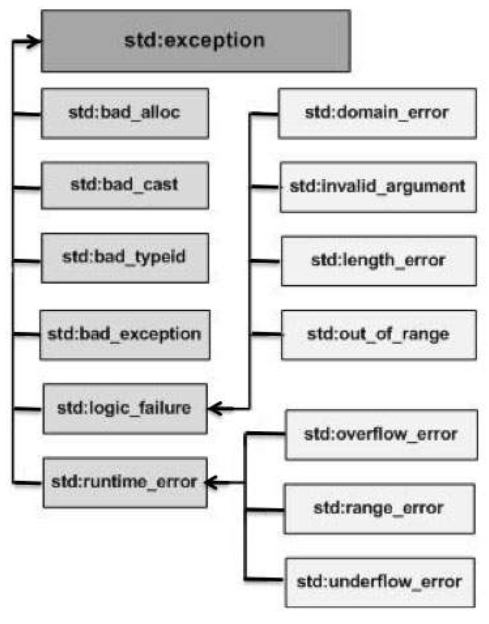

# C++ Notes

### C Basics
* [Function](#function)
* [Pointer](#pointer)
* [Switch Statement](#switch_statement)

### Basic Concepts
* [Binary earch](#binary_Search)
* [Object Oriented Programming](#object_oriented_programming)
* [Operator Overloading](#operator_overloading)
* [Programm Organization](#program_organization)
* [Recursion](#recursion)
* [Software Testing](#software_testing)

### Basic Elements
* [Auto Pointers](#auto_pointers)
* [Namespace](#namespace)
* [Scope](#scope)
* [Stream](#stream)
* [Structs](#structs)
* [UML](#uml)
* [Unordered Map](#unordered_map)
* [Using](#using)
* [Vector](#vector)
* [Linked Lists](#linked_lists)

### [Exception](#exceptions)
* [Exception Class](#exception-class)
* [Custom Exceptions](#custom_exceptions)

### [Class](#class)
* [Class Arrays](#class_array)
* [Class Vector](#class_vector)
* [Constructor](#constructor)
* [Destructor](#destructor)
* [Member function](#member_function) [(this)](#self-reference)

### ------------------------------------------------------------

# C Basics

### ------------------------------------------------------------

<a name="function">

## Function

[ [ Top ] ](#top)

### Deafult arguments

	int myfunc(int x, int y = 3, double z = 0.0)

* Assigns variables a default value if one not specified
* Cannot appear to left of non-default args.... They have to be at the right most

### Reference parameters

	void increment(int& x) {x++;} //...
	int n(41);
	increment(n); //now n is 42 
	//syntax error: increment(41);

* Denoted by & after type name
* Cannot pass constant values in for a ref. parameter
</a>

### ------------------------------------------------------------

<a name="pointer">
## Pointer
[ [ Top ] ](#top)

###### ・Pointer arithmetic: arr[n] is equivalent to *(arr+n)

	int arr[] = {1, 3, 6, 10, 15};
	int* ptr = &arr[3]; //points to 10 (same as arr+3)
	cout << *ptr << endl; //prints 10
	cout << ptr[1] << endl; //prints 15
	cout << ptr[-2] << endl; //prints 3

### Auto Pointer

	#include <memory>
	//...
	unique_ptr<int> varname(new int);
	unique_ptr<char[]> varname(new char[10]);
	shared_ptr<double[]> ptr(new double[10]);

###### ・Automatically frees itself when not needed
###### ・Use type[] if storing an array
###### ・Unique pointers: memory freed when leaving scope (unless return value) or reassigning

	unq_ptr = unique_ptr<type>(new_memory_loc);

###### ・Shared pointers: freed when no more point to that array

</a>

### ------------------------------------------------------------

<a name="switch_statement">
## Switch Statement
[ [ Top ] ](#top)

Check for a value(expression) and execute each cases based on what the value is.
Use break; to stop, otherwise it'll keep executing cases below.

	switch (grade)
	{
		case 1: cout << "A";
				break;
		case 2: cout << "B";
				break;
		case 3: cout << "C";
				break;
		case 4: cout << "D";
				break;
		case 5: cout << "F";
				break;
		default:
				cout << "Value is wrong";
	}
	cout << "\n";
</a>

### ------------------------------------------------------------

# Basic Concepts

### ------------------------------------------------------------

<a name="binary_Search">

# Binary Search
[ [ Top ] ](#top)

Way to search a value in an array, string etc.
Main idea
* Look at middle
* Then look at left or right half
* Repeat until you find it or run out of values

	Search for 29
    | 2 | 3 | 5 | 7 | 11 | 13 | 17 | 19 | 23 | 29 | 31 | 37 | 41 | 43 | 47 |

Code Example

    int binsearch(int tgt, int* arr, int len) 
    {
      if (len == 0)
        return -1; //tgt not in arr
      int mid = len / 2; if (arr[mid] == tgt)
        return mid;
      else if (arr[mid] > tgt)
         return binsearch(tgt, arr, mid);
      else
        return mid+1 + binsearch(tgt, &arr[mid+1], len – mid - 1);
    }

</a>

### ------------------------------------------------------------

<a name="object_oriented_programming">

## Object oriented programming
[ [ Top ] ](#top)

* Focus on objects(nouns) instead of what it does and how it acts(verbs)
* Class defines *data* and *methods* 
   * How it interacts with the rest of the program   

* Class: user-defined data type
* *objects* or *instance*: variable with class type

</a>

### ------------------------------------------------------------

<a name="operator_overloading">

# Operator Overloading
[ [ Top ] ](#top)

Way to define function named by operators

	str += " world" IS SAME AS str.operator+=(" world")

Two ways to use
* Define operator as member function
	-Object must always be on LHS
    	Complex c2 = c + 1.0 is LEGAL(c.operator+(1.0))
        Complex c2 = 1.0 + c is NOT

* Define separate function
		Complex operator+ )double, Complex&)
        Complex::operator+ (double)

</a>

### ------------------------------------------------------------

<a name="program_organization">

## Program Organization
[ [ Top ] ](#top)

* Devided into *header* and *source* files
* *header* define the interface used to interact with a program or library
   * Define constants, data types, functions, classes, libraries
   * Not for describing functions or classes

         Analogy: driving a car
         ・Interfce consists of steering wheel, accelerator, brake, etc,
         ・No need to know how they work
   * Source file(.cpp) describe how a program works

* Class definition appear in preamble(header file)
      #include "bankacct.h" in .cpp file
* Member function implementations appear in source file
* Each class will typically get its own source/header file pair
###### One class has (.h file) and (.cpp file) additional to (.cpp main function file)

</a>

### ------------------------------------------------------------

<a name="recursion">

## Recursion
[ [ Top ] ](#top)

</a>

### ------------------------------------------------------------

<a name="software_testing">

## Software Testing
[ [ Top ] ](#top)

### Functional Testing
* known as "black-box" testing
* Focuses on code output, not how it functions
	-**EX**: "what it's supposed to do"
    -Doesn't need source, just executable
* **Main idea:** run code using "boundary cases" for input
	-Test values inside, on, and just outside the boundaries
##### Example -what should you check
	* Numeric: 0, negative values, max value, min value
	* Strings: empty string, max length, multiple words, letters, digits, symbols, whitespace
	* Arrays/vectors/lists: empty, max size
	* Trees: empty, balanced, complete, unbalanced(all left or all right), max size

###### Exercise
Describe a set of black-box testing inputs to the function below.

	/*
    The following function accepts a string and returns whether or not it is a palindrome, ignoring capitalization and non-letter characters
    */
    bool isPalindrome(string test);

### Structual testing
* Also known as "white-box" testing
* Generates test cases based on decision points in code
	-If/switch: test all possibilities, including else/default
    -Loops: iterate 0 times, 1 time, mac number of times

##### 4 levels of testing
###### Statement coverage
* All statements executed at least one
###### Decision coverage
* Take both outcomes of each decision point at least once
* Statement coverage doesn't need to test "one-sided" if conditions
    	if (x < 0) x = -x;
###### Condition coverage
* Test all subparts of branch and loop conditions
        if (ptr != null_ptr && *ptr > 0) //...

* Need to test when ptr is null, *ptr > 0, and *ptr <= 0
    * Decision testing only needs one success and one failure test

###### Path tesing
* Test all combinations of branch and loop outcomes
	* Not generally feasible
* Focus on testin on banches/loops with dependencies
	* Involve the same variables, etc.

###### Exercise
• Describe a set of white-box test cases for the isPalindrome implementation to the right.
• Focus on decision coverage to start, then try to add cases up to condition coverage

    bool isPalindrome(string test) 
    {
      int left = 0;
      int right = test.length() - 1;
    
      while (!isalpha(test[left]) && left < right) 
        left++;
      while (!isalpha(test[right]) && left < right)
        right--;
        
      while (left < right)
      {
        if (tolower(test[left]) != tolower(test[right])) 
          return false;
          
        left++;
        while (!isalpha(test[left]) && left < right)
          left++;
          right--;
        while (!isalpha(test[right]) && left < right)
          right--; 
      }
      return true;
    }

</a>

### ------------------------------------------------------------

# Basic Elements

### ------------------------------------------------------------

<a name="auto_pointers">

# Auto Pointers
[ [ Top ] ](#top)

It is a special type of pointer.
It automatically frees itself when not needed.
Two types
* Unique pointers: memory freed when destroyed or reassigning
		unique_ptr = unique_ptr<type> (new_memory_loc);
* Shared pointers: freed when no more point to that array

##### Syntax

    #include <memory>
    //...
    unique_ptr<int> varname(new int); unique_ptr<char[]> varname(new char[10]); shared_ptr<double[]> ptr(new double[10]);

* Use *type[]* if storing an array
* *, [] (if array type), NO POINTER ARITHMETIC

</a>

<a name="exceptions">

# Exceptions
[ [ Top ] ](#top)</a>

* [Exception Class](#exception-class)
* [Custom Exceptions](#custom_exceptions)

Exceptions provide a way to react to exceptional circumstances (eg. runtime error, attempt to divide by zero) in programs by tansferring control to special functions called *handlers*
##### C++ exception handling is built upon three keywords

* throw
* try
* catch

#### throw

A function throws an exception when it detects a problem by using the *throw* keyword from inside the *try* block.  
It will tri to match thrown type against *catch* blocks until it finds a match

##### Syntax

	throw [obj];

-can throw anything  
-can have multiple catch blocks for different types of errors

#### try

A *try* block identifies a block of code for which particular exceptions may be thrown.  
*try* block ends if an exception occurs.  
It is followed by one or more *catch blocks*.  

#### catch

Exception handlers are declared with the keyword *catch*.  
It must be placed immediately after the *try* block to catch the thrown exceptions and handle it.  
*catch* (...) matches every exception.  
May have multiple *catch* blocks.  
Inside *catch*: *throw*; (no object) "rethrows" exception.  

##### Example

    try
    {
         //protected code where exception may occur
    }
    catch ( ExceptionName & e1 ) 
    {
         //catch block fro exception e1
    }
     ...
    catch ( ExceptionName & eN )
    {
    	//catch block for Nth exception
    }

Hierarchy of standard exceptions

Exception | Description
 --- | ---
std::exception | Parent class of all the standard C++ exceptions.
std::bad_alloc | This can be thrown by new.
std::bad_cast | This can be thrown by dynamic_cast.
std::bad_exception | This is useful device to handle unexpected exceptions in a C++ program
std::bad_typeid | This can be thrown by typeid.
std::logic_error | An exception that theoretically can be detected by reading the code.
std::domain_error | This is an exception thrown when a mathematically invalid domain is used
std::invalid_argument | This is thrown due to invalid arguments.
std::length_error | This is thrown when a too big std::string is created
std::out_of_range | This can be thrown by the at method from, for example, a std::vector or std::bitset<>::operator.
std::runtime_error | An exception that theoretically cannot be detected by reading the code.
std::overflow_error | This is thrown if a mathematical overflow occurs.
std::range_error | This is occured when you try to store a value which is out of range.
std::underflow_error | This is thrown if a mathematical underflow occurs

###### Example

	#include <iostream>
    using namespace std;
    
    int main() {
      try {
        throw 20;
	  }
      catch (int e) {
        cout << "An exception occured. Exception No. " << e << '\n';
      }
    }

###### Output  

	An exception occured. Exception No. 20

<a name="exception-class">

### Exception Class
[ [ Top ] ](#top) [ [ Exception ] ](#exceptions)

The *exception* class
-Defined in

	<exeption>

-Constructed with *const char** or *string*

</a>

<a name="custom_exceptions">

### Custom Exceptions
[ [ Top ] ](#top) [ [ Exception ] ](#exceptions)

You can define your own exceptions by inheriting and overriding *exception* class functionality.

###### Example of using std::exception class to implement a custom exception

	#include <iostream>
	#include <exception>
	using namespace std;

	struct NonPositive : public exception {
		const char * what () const throw () {
			return "Integer must be positive";
		}
	};

	int getPositiveInt() {
		int i;
		cin >> i;
		if(i <= 0)
			throw NonPositive;
		reurn i;
	}

throw() indicated that no exceptions will be thrown in this function.  
The exception is not caught inside the function.  
It should be caught by the code that called the function.  

###### Example 2

	//file try_cach.cpp
	#include >iostream>
	#include <exception>
	#include "NonPositive.h"

	itn main() {
		try {
			int i = getPositiveInt();
		} catch (NonPositive& e) {
			std::cout << "Exception caught" << endl;
			std::cout << e.what() << endl;
		} catch (exception& e) {
			//Other errors
		}
	}

###### Output

	$ g++ try_catch.cpp
	$ a
	-5
	Exception caught
	Integer must be positive

*what()* is a public method provided by the parent exception class.  
It has been overridden by the child exception class.  
This returns a message descriving the exception.  

###### Custom RuntimeException

	#include <string>
	class RuntimeException{
	private:
		std::string errorMsg;
	public:
		RuntimeException(const std::string& err) {errorMsg = err; }
		std::string getMessage() const {
			return errorMsg;
		}
	};

</a>

<a name="namespace">

## Namespaces
[ [ Top ] ](#top)

##### Creates a *named* scope
* Useful in large projects
	-No need to worry if someone else is using same variable names
    
##### Declaring
	namespace myns {
	   int x;
	   void f(int x) {/* ... */;} void g();
	}

##### When you access
* Accessing namespace elements outside namespace: 
	-Scoperesolutionoperator(::)   
    
	   myns::x  
* Namespaces can be nested
   *– myns::innerNamespace::func()   

</a>

### ------------------------------------------------------------

<a name="scope">

## Scope Review
[ [ Top ] ](#top)

	This thing
    {}

* Every variable and function has a scope
   * Part of code where you can access it  
   * Generally defined by innermost set of curly braces  
* Same names not allowed in same scope
   * Allowedindifferentscopes  
* Local variables are erased when out of scope
* Variables with same name "shadow" variables in larger scope
###### Example: 

		int main() {
			int i(20);
			for (int i = 0; i < 10; i++)
				cout << i << endl; //will never print 20
			cout << i << endl; //20
		}

</a>

### ------------------------------------------------------------

<a name="stream">

## stream
[ [ Top ] ](#top)

### stringstream

	#include <sstring>

### istringstream

Input stream. Store a string on a memory(stream).

### ostringstream

##### Use while loop to read the string

	#include <iostream>
	#include <sstream>
	using namespace std;
	int main(){
		string str("Hello");
		istringstream iss(str);
		char c;
		while(iss >> c)
		{
			cout << c << endl;
		}
		return 0;
	}
	output: 
	H
	E
	L
	L
	O

### Radom access with streams

##### ifstream:
* .seekg(pos): moves to given position in file
* .seekg(pos, rel_to): moves around in file, rel_to:
   * ios_base::beg: move to position relative to beginning of file  
   * ios_base::end: relative to end of file (pos <= 0)  
   * ios_base::cur: relative to current position (+/- pos)  
* .tellg(): returns current position

##### Same syntax for istringstream (not for cin)

##### ofstreamandostringstream:
* .seekp(pos): same usage as seekg
* .seekp(pos, rel_to): same usage as seekg
* .tellp(): same usage as tellg
* "g" and "p" stand for "get" and "put"

### fstream

##### fstream: read and/or write file
* Can take place of ifstream or ofstream – Somewhatmorecomplexsyntax

##### Creating:
   * fstream streamName(filename, mode);   

##### Mode flags: similar to fopen – ios_base::in: read file
* ios_base::out: write to file
* ios_base::binary: read/write in binary
* ios_base::trunc: truncate file
* ios_base::app: append to file
* Default: read and write, no truncation, starts at file beginning 
* Combinew/|(e.g.,ios_base::write|ios_base::app)

##### Use: identical to ifstream or ofstream
	 >>, getline, read, <<, write, seekg, seekp, etc.

</a>

### ------------------------------------------------------------

<a name="struct">
## Structs
[ [ Top ] ](#top)

##### Used to group multiple related pieces of data 
* E.g.,realandimaginarypartsofcomplexnumber 
* Parallelarrays

		struct complex {
		double re;
		double im; };
		   //...
		   struct complex x={0,1};
		   cout << "x = " << x.re
		        << " + " << x.im
		        << "i\n";

		typedef struct {
		double re;
		double im;
		} complex_t;
		//...
		complex_t x={0,1}; cout << "x = " << x.re
		     << " + " << x.im
		     << "i\n";

</a>

### ------------------------------------------------------------

<a name="uml">
## UML
[ [ Top ] ](#top)

### Unified Modeling Language
* Common set of symbols for diagrams
	-Also used frequently in database design

Representing classes

        |         Class            |
        | ------------------------ |
        | - data_member : type     |
        | - another_member : type  |
        | ------------------------ |
        | + Constructor(arguments) |
        | + Member_functions(args) : return_type |

* 3 part
	* Top: class name
	* Middle: data members
	* Bottom: mmeber functions
* Access modifiers
	* "+" public
	* "-" private

### Class Relationships

* Composition
	*  One class is data member of another
	*  Denoted by ーー◆
	*  Diamond may be annotated with multiplicity
		* how many instances are contained?(usually 1)
* Associations
	* Can be used when one object accepts another as a member function parameter
	* Denoted by ーー→(1-way)or ーーー(2-way)

##### Example

#### Types of rekationships

* One-to-One
	* Every A has exactly 1 B and every B has exactly 1 A
	* **EX**: ll citizens have unique SSN
	* Add data ember or pointer to one or both side(s)
* One-to-Many
	* An A might have man B's, but B's only have 1 A
	* **EX**: films have a director
	* Often stored by adding data member for "one" side to "many" side
* Many-to-One
	* A's have 1 B, B's may have mnay A's
	* Similar to one-to-many
* Many-to-Many
	* Every A may have multiple B's, and every B may have multiple A's
	* **EX**: customers buying items
	* Consider creating object with links to both
	* **EX**: PurchaseRecord(Customer, Item)

##### Example

</a>

### ------------------------------------------------------------

<a name="unordered_map">

## Unordered map
[ [ Top ] ](#top)

	#include <unordered_map>

### Syntax
	
### Adding elements
    map.insert(pair<string, int>("stringhere", 0);

</a>

### ------------------------------------------------------------

<a name="using">

## Using
[ [ Top ] ](#top)

* Import variables into a namespace with using

		using myns::x; //Use x instead of myns::x  
		using namespace myns; //Imports all of myns   

* Saves typing
* Can cause problems if name already in use
* namespace std: all C++ built-in libraries
   * std::cout, std::endl, std::ifstream, etc.   

##### Global namespace
   * Can use :: to access shadowed global variables   

			int x = 10; //global
			void foo() {
				int x{0};
	     		cout << ::x << endl;  //prints global x
	   		}

</a>

### ------------------------------------------------------------

<a name="vector">

## Vector
[ [ Top ] ](#top)

	#include <vector>

* Similar to array but can add arbitrarily numbers
* No need to deallocate

#### Declaring

	vector<type> vec;
	OR
	vector<type> vec(num, val);
	*vec* starts with *num* values equal to *val*

#### Adding elements

	vec.puch_back(val);

#### Deleting last element

	vec.pop_back();

#### Clear
	vec.clear();

#### Accessing elements
	vec[0] or vec.at(0);
	.at() checks if the reference is valid

#### Check number of elements
	vec.size();

#### Range-based for loops
* Alternate way to iterate through arrays and vectors
* No need to worry about going out of bounds

	vector<int> vec;
	//put things in vec
	for (int i : vec)
		cout << i << endl;

</a>

### ------------------------------------------------------------

<a name="linked_lists">

## Linked Lists
[ [ Top ] ](#top)

Linked list is a collectioj of components which are called "nodes".

Every node contains address of the next node and last node contains address to nullptr.

###### Node components

	data(elem): stores relevant information
	next: stoes address of the following node

"head" pointer points to the first node in the list.

"->" arrow points to target of the node address stoered in the node's nect field

</a>

<a name="class">

## Classes(#class)
[ [ Top ] ](#top)

* [Class Arrays](#class_array)
* [Class Vector](#class_vector)
* [Constructor](#constructor)
* [Destructor](#destructor)
* [Member function](#member_function) [(this)](#self-reference)

* Data that an object represents
   * Data members or fields   
   * Each object has its own data members  
* Function that define how object can be used
   * Member functions or methods  
   * All objects "Share" the same functions
* Protects data-> Reduces chance for bugs in code

### Class design
* What does it represent
   * what data members?  
* How users interact with the class?
   * What are common/important operation?
   * How does it interact with other clsses?

### Defining classes
      class Class_name 
      {
      public:
         void member_function1(); 
      private:
          int data_member1;
         //... 
      };

* Class definition go in header(file)
* Class names are capitalized
* Don't forget the semicolon at the end

### Access modifiers - Encapsulation
* public
   * Anyone can call or modify  
   * Used for Functions  
* private
   * Only class member function can access 
   * Used for data members  
* protected
   * same as private 

### Using classes
###### Declaring a class
      Class_name obj;
      Class_name obj(constructor_args);

* Anonymous objects
      Class(name(constructor_args)
   * Destoyed immediately if not assigned  

* Use . to access functins and data members
      str.length(); complex.re
   * Private fields can only be accessed inside class member functions  
   * Data members can modify other objects of the same class

* Constructed at variable declaration
* Destroyed automatically when object passes out of scope, overwritten, etc.

### Class pointers
* Syntax similer to dynamic arrays
      Class* ptr;
      ptr = new Class(args...);
      delete ptr;

* Shortcut: -> It dereferences first
      strotr->length()   //Or (*strptr).length()

* Constructed on new, destroyed on delete
* Class arguments to functions are usually pointers or references
   * Avoid making a copy of the object
   * Pointers are always 4 or 8 bytes
   * Copying an object uses a special copy constructor

### define a value in a class
* Use *enum* or *static const* and have it in the class definition

      class Myclass {
        static const int N = 100;
      public:
        Myclass()
          : m_n(N)
        {
        }
      };

</a>

### ------------------------------------------------------------

<a name="member_function">

## Member functions
[ [ Top ] ](#top)

      void Date::print()
      {
         //code goes here
      }

* This goes in .cpp file paired with .h file for the class
* Scope resolution operator(::)
* Name, return type and arguments must match class definition
* Can access or modify any private data members

### Inline function definitions
* Simple functions my be defined directly in header
* Put function body after declaration (in .h file)
* Generally only used for very simple functions (1-line)
* Inlie getters and setters are fairly common

      class CokeMachine 
      {
      private:
         double currentChange;
         //...
      public: 
         //...
         double getCurrentChange() const
         { return currentChange; }
      };

</a>
### ------------------------------------------------------------

<a name="self_reference">
## Self Reference
[ [ Top ] ](#top)
### *this* keyword
* pointer to the current object
* it has access to its own address through *this* pointer
* implicit parameter to all member functions
* *this* can be used to refer to the invoking object of its own

        int compare(Box Box){
            return this->Volume() > box.Volume();
        }
</a>

### ------------------------------------------------------------

<a name="constructor">

## Constructors
[ [ Top ] ](#top)

* Goal: ensure that all data members are initilized to some meaningful value
* Classes should almost always have a default(no argument) constructor
* Function called when object is created. constructors are only called when creating objects

      public:
         Date();
      This is default constructor.
* Implementing constructor/destructor is in .cpp file

      Date::Date()
      {
        day = 1; month = 1; year = 2000;
         //Could also call setYear(2000); 
      }

      Date::~Date() 
      {
      }

### Alternative way of constructor syntax

      Date::Date(int m, int d, int y)
           : day(d), month(m), year(y)
      {
      }

* Input variable straight goes into constructor
* This can specify some or all data members
* Can also combine with default arguments
###### Advantage
* Clearly conveys how data members initialized from args

###### Disadvantage
* No input checking
* Not a good idea for Date class!

### Accessors and mutators
##### Mutators change class data members
* Should always check input validity
      void setYear(int year)

##### Accessors report or compute values without changing data members
* Generally followed by *const* keywords
   * Modifing data mambers becomes a syntax error
         int getYear() const

      void Date::setYear(int newYear) 
      {
         if (newYear == 0) 
            year = 1;
         else
            year = newYear;
      }

##### Copy constructor
* Creates a new object that is a copy of another of the same type
* Invoked every time a function with a class object parameter is called
* Makes a "Deep copy" and deep copy is possible on ly with user defined copy constructor
      Class(Class& copy);
      Class(const Class& copy);

      #include<iostream>
      using namespace std;
       
      class Point
      {
      private:
          int x, y;
      public:
          Point(int x1, int y1) { x = x1; y = y1; }
       
          // Copy constructor
          Point(const Point &p2) {x = p2.x; y = p2.y; }
       
          int getX()            {  return x; }
          int getY()            {  return y; }
      };
       
      int main()
      {
          Point p1(10, 15); // Normal constructor is called here
          Point p2 = p1; // Copy constructor is called here
       
          // Let us access values assigned by constructors
          cout << "p1.x = " << p1.getX() << ", p1.y = " << p1.getY();
          cout << "\np2.x = " << p2.getX() << ", p2.y = " << p2.getY();
       
          return 0;
      }

      Output:

      p1.x = 10, p1.y = 15
      p2.x = 10, p2.y = 15 

##### Move constructor
* Initializes an object from an anonymous object
* Anonymous object would be destoyed after construction
* "Steal" data from parameter insted of copying
* Useful when data members are large
* Rvalue Reference
   * Rvalue = unnamed value that exists only during the evaluation of an expression.
         ex)
         x+(y*z);
         C++ creates a temporary (an rvalue) that stores the result of y*z, and then adds it to x. Conceptually, this rvalue evaporates by the time you reach the semicolon at the end of the full expression.

######  
      ClassName(ClassName&& move)

      MyString::MyString(MyString&& move) 
      {
         data = move.data;
         move.data = nullptr; //Alternate syntax for NULL 
      }

</a>

### ------------------------------------------------------------

<a name="destructor">

## Destructors
[ [ Top ] ](#top)

* Function called when object is destroyed
   * When local variable passes out of scope  
   * Free allocated memory, close files, etc.
         public:
         //...
            ~Class_name();
* No parameters
* There's a default destructor but it's bad not to have destructors manually

</a>

### ------------------------------------------------------------

<a name="class_array">

## Class Arrays
[ [ Top ] ](#top)

### Syntax
	Class* ar = new Class[numElements];

* Always uses default constructor
* Cannot allocate without one

Elements can be referenced and modified as normal

	arr[i].print();

Deallocation the array
	
    delete[] arr;

* Destroys every element, then frees the array

</a>

### ------------------------------------------------------------

<a name="class_vector">

## Collection of objects
[ [ Top ] ](#top)

### Class vector
	vector<Class> vec;

* Uses move constructor(if defined)

</a>

### ------------------------------------------------------------
